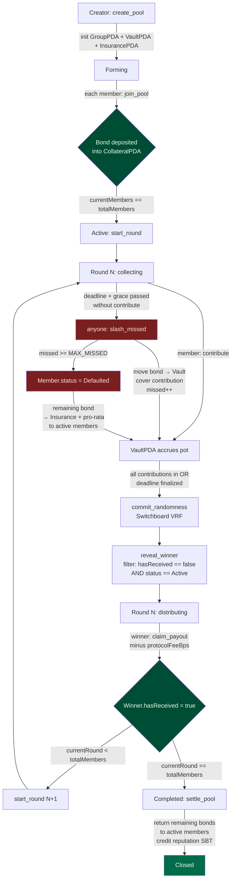

# Payment Commitment

## Summary

Every member locks a **collateral bond** into the pool's PDA escrow the moment they join, before a single round runs. The bond is large enough to cover each member's remaining monthly contributions after they've been drawn (roughly `(N - 1) × monthly`, tunable via `collateralBps`). If a drawn member stops paying, the smart contract slashes their bond on each missed deadline: the slashed amount auto-funds that round's contribution so non-defaulting members are made whole, and repeated misses mark the member as `Defaulted` — their remaining bond is redistributed pro-rata to the honest members and their reputation SBT is debited. Because the bond is already escrowed on-chain and only released after the cycle completes, a winner who tries to walk away loses more than they'd save by skipping payments.

## Contract Flow

### Key invariants the program enforces

| Invariant | Instruction that checks it |
|---|---|
| Bond ≥ remaining obligation after a possible win | `join_pool` |
| Only non-winners are eligible for draw | `reveal_winner` |
| Missed payment is covered from the defaulter's bond, not from honest members | `slash_missed` |
| A member can only win once per pool | `reveal_winner` + `Member.hasReceived` flag |
| Bonds unlock only after `currentRound == totalMembers` | `settle_pool` |

### Economic lock-in

- **Pre-draw incentive**: a skipper loses their bond plus their chance at the pot.
- **Post-draw incentive**: the bond is sized so that walking away after winning costs more in slashed collateral than the value of the remaining contributions owed. Every slash also decrements the on-chain reputation SBT, which gates access to larger future pools.
